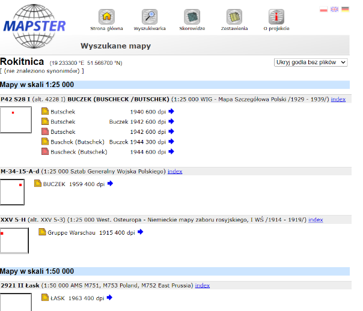
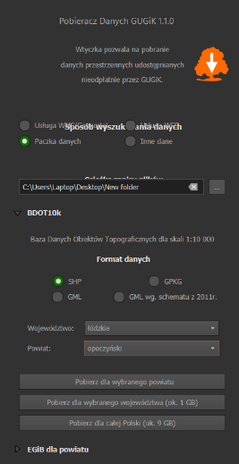
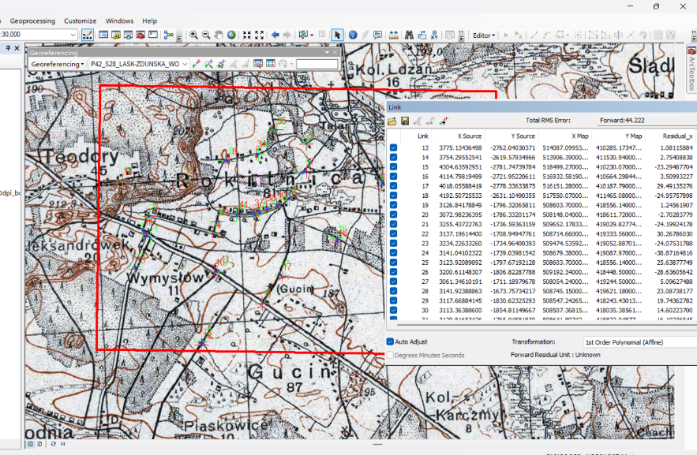
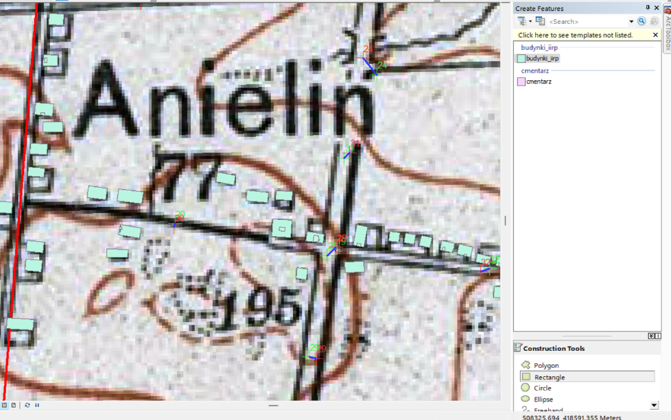
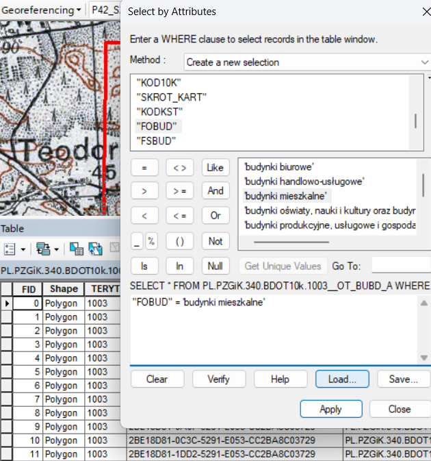
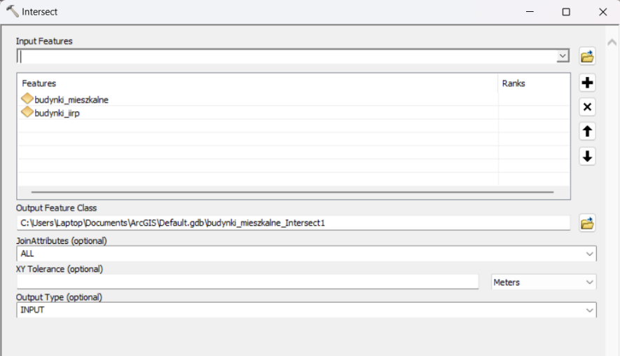
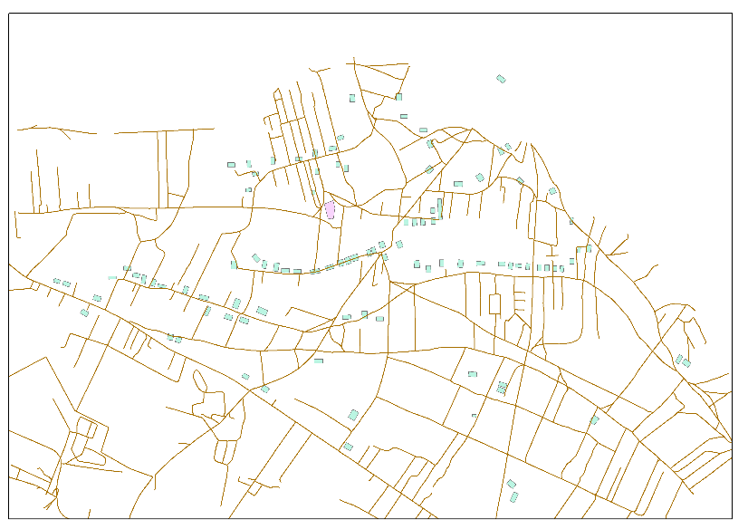

# Morfologia wsi Rokietnica i Anielin

Projekt badawczy poświęcony analizie przestrzennej układów osadniczych i badaniu morfologii wsi Anielin i Rokietnica w powiecie łaskim. Zalążkiem do analizy była historyczna [kolonizacja niemiecka](https://pl.wikipedia.org/wiki/Kolonizacja_fryderycjańska) na tychże terenach i jej rozwój od początku XIX wieku do czasów współczesnych. Repozytorium zawiera opracowanie, gotowe mapy do podglądu.

Cytując z własnego tekstowego opracowania zaliczeniowego:

Celem przeprowadzonej analizy było zbadanie morfologii wsi po drugiej wojnie światowej. Wsie zostały dobrane tak żeby moc ten proces uwypuklić, niegdyś żyjące tam niemieckie społeczności sprowadzone na przełomie XVIII i XIX wieku kształtowały swoje wioski, tworzyli zgromadzenia ewangelickie, a po 1945 roku zostało to zastąpione polska, katolicka ludnością. Do stworzenia tego raportu zostało wykorzystane narzędzie GIS o nazwie ArcMap oraz Geoportal Krajowy, a dane i wiedza została zaczerpnięta z artykułów internetowych, prac naukowych oraz map przedwojennych i współczesnych dostępnych online. Dane są aktualne na dzień 30 kwietnia 2024 roku. Proces analizy został przeprowadzony od zebrania informacji, po zebraniu i ich odpowiedniej edycji w oprogramowaniu wyciągniecie wniosków w postaci dokumentu z komentarzem.

Proces tworzenia został oparty o metodę historyczną i kartograficzną, czyli analizę starej mapy WIG-owskiej obejmujący zasięgiem miasto Łask i okolice z roku 1929, wykonanej w skali 1:100.000 i porównanie jej ze współczesnymi dostępnymi danymi.. Poniżej znajdują się kroki zrobione podczas robienia projektu mapy do analizy.

- Znalezienie i pobranie danych współczesnych (mapa BDOT10k z GK) i historycznych (mapa WIGowska z igrek.amzp) w dniu 30.04.2024

- Georeferencja mapy historycznej w programie ArcMap metodą dopasowania koordynatów z mapy do punktów kontrolnych.

 

- Digitalizacja sieci budynków z mapy WIGowskiej oraz cmentarzy na bazie obydwóch map do formy wektorowej

- Dodanie obiektów współczesnych z danych BDOT do projektu mapy i wycięcie ich do obszaru opracowania. 

- Użycie narzędzia Intersect w programie ArcMap w celu złączenia wspólnych części dwóch warstw budynków historycznych i współczesnych 

Tym o to sposobem uzyskaliśmy potrzebny nam materiał do analizy zmian w morfologii obydwu lokacji.

Mapa cmentarza i budynków przedwojennych ze współczesnymi drogami we wsi Rokitnica

